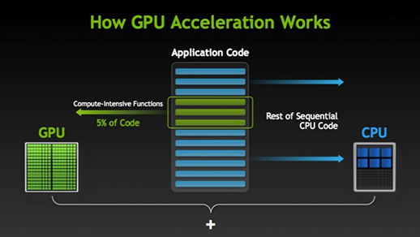

---
author:
- Ashwin Srinath
subtitle: CCIT CITI
title: GPU Programming
institute: Clemson University
fontsize: 12pt
...

# GPUs: what are they?

* **Computing devices**: traditionally good for graphics calculations.
Have evolved to be more general-purpose

* **Massively parallel processors**: 1000s of small, "weak" cores as opposed to 
handful of fast, powerful cores (CPU)

* **Accelerators:**, not computers: memory space different from CPU.
Applications typically primarily run on the CPU, but offload compute intensive
parts to the GPU

---

# GPUs: what are they?

---

# Application areas using GPUs

* Numerical simulation: CFD, Computational Chemistry, Computational Mechanics, Weather Sciences, etc.,
* Artificial Intelligence and Machine Learning
* Imaging and Computer Vision
* Bioinformatics and Data Science

---

# Using GPUs

## Three ways to accelerate applications using GPUs

* **1. GPU Programming**
    - Programming models: CUDA, OpenCL - we'll focus on CUDA
    - **Programming languages**: C, C++, Fortran - we'll use C today
    - Other languages like Python, MATLAB and R can interface with CUDA - we'll see an example of this with Python
    - Most performance and flexibility, but requires the most effort

---

# Using GPUs

## Three ways to accelerate applications using GPUs

* **2. CUDA-enabled libraries**
    - "Drop-in" GPU acceleration requiring small amount of code changes
    - Libraries available for Machine Learning, Linear Algebra, Parallel Algorithms, Signal Processing, etc.,
    - Less effort than programming "from scratch", library functions are generally well-tested and performant

---

# Using GPUs

## Three ways to accelerate applications using GPUs

* **3. Compiler directives**
    - Least effort, requires minimal changes to code
    - Compiler handles details of parallelism management and data movement to/from GPU
    - Uncertain performance
